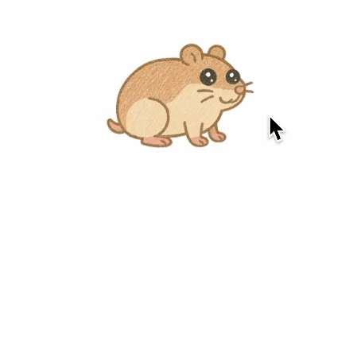

# 햄스터 똥치우기 게임

<center>


햄스터의 똥을 치우며 점수를 획득할 수 있는 미니게임입니다.</b> <br />

👉 배포 주소: https://zikzik.dev

</center>

<br />

# 🛠️ 기술 스택

<table>
<tr>
 <td align="center">언어</td>
 <td>
  
 </td>
</tr>
<tr>
 <td align="center">프레임워크</td>
 <td>
  
  
 </td>
</tr>
<tr>
 <td align="center">CSS 프레임워크</td>
 <td>
  &nbsp
 </td>
</tr>
<tr>
 <td align="center">패키지</td>
 <td>
    
  </td>
</tr>
<tr>
</table>

<br />

# 🚀 프로젝트 실행 방법

### 필수 설치

- Node.js
- npm
- JDK

### 설치 및 실행

1. 프로젝트를 로컬 환경으로 복제합니다.

```shell
git clone https://github.com/biyamn/hamster-game.git
```

2. 프로젝트 frontend 디렉토리에서 아래 명령어를 입력하여 의존성 패키지를 설치합니다.

```shell
$ cd frontend
$ npm install
```

3. 프로젝트 frontend 디렉토리에서 아래 명령어를 입력하여 프로젝트를 실행합니다.

```shell
$ npm run dev
```

4. 프로젝트 backend 디렉토리에서 아래 명령어를 입력하여 프로젝트를 실행합니다.

```shell
$ cd backend
$ ./gradlew run
```

### 접속 주소

- 프론트엔드: http://localhost:3000
- 백엔드 API: http://localhost:8080

<br />
